## XTween 动画插件
### 概述
------------
XTween 是一个高性能的 Unity 动画系统，提供了丰富的动画类型、缓动效果和灵活的控制方式。它采用对象池技术优化性能，支持编辑器预览，适用于 UI 和游戏对象的动画处理。 并且该插件是一个功能全面、性能优化的 Unity 动画解决方案，适用于各种动画需求，从简单的 UI 动效到复杂的游戏对象动画。其架构清晰度和零GC设计特别适合需要大量动态动画的项目（如UI密集型游戏）。相比主流插件，它在类型扩展性和内存控制上有独特优势，而链式API和完整文档则降低了使用门槛
<br>
<br>
| 开源不易，您的支持是持续更新的动力，<br>这个小工具倾注了我无数个深夜的调试与优化，它永远免费，但绝非无成本，如果您觉得这个工具<br>能为您节省时间、解决问题，甚至带来一丝愉悦，请考虑赞助一杯咖啡，让我知道：有人在乎这份付出，而这将成为我熬夜修复Bug、<br>添加新功能的最大动力。开源不是用爱发电，您的认可会让它走得更远| |
|:-|-:|
| **欢迎加入技术研讨群，在这里可以和我以及大家一起探讨插件的优化以及相关的技术实现思路，同时在做项目时遇到的众多问题以及瓶颈<br>阻碍都可以互相探讨学习**| |

<br>

### 📦 架构设计特色
---
#### - ✅**分层架构** 
- **核心层：XTween_Base<T> 抽象基类处理通用动画逻辑（生命周期/进度计算/回调系统）**
- **实现层：7种特化类型（Float/Int/Vector2/Vector3/Color/Quaternion/String）各自实现类型安全的插值计算**
- **管理层：XTween_Manager单例全局管理，XTween_Pool对象池优化性能**
#### - ✅**多态设计** 
- **通过抽象方法强制子类实现类型相关逻辑：**
```
protected abstract T Lerp(T a, T b, float t);
protected abstract T GetDefaultValue();
```
#### - ✅**ECS式数据驱动** 
- **每个Tween实例包含完整动画参数（start/end/duration/easeMode等）**
- **通过Update()方法纯数据计算，与Unity组件解耦**

### 📦 性能优化特色
---
- **零GC设计**
- **使用对象池（XTween_Pool）复用实例**
- **链表+字典管理活跃动画（避免List扩容）**
- **预编译指令分离编辑器/运行时逻辑**
- **高效更新机制**
- **双缓冲队列：_PendingAdd/_PendingRemove避免迭代时修改**
- **迭代器缓存：_ActiveTweens_CachedIterators减少遍历开销**
- **延迟计算：按需重建缓存（_IteratorsDirty标记）**
- **内存安全**
- **自动清理无效引用（CleanDeadReferences）**
- **回调注销检查（避免内存泄漏）**

### 📦 核心组件
------------
|🌱 Controller|🌱 Interface|🌱 Pool|🌱 Manager|🌱 EaseLibrary|🌱 Previewer|
|:---:|:---:|:---:|:---:|:---:|:---:|
|**动画控制器**|**动画接口**|**动画池**|**动画管理器**|**缓动库**|**预览器**|
|动画控制器，支持多种动画类型（位置、旋转、缩放、颜色等），可配置动画参数（持续时间、延迟、缓动模式等，提供按键控制（播放、倒带、终止等）**|支持多种动画类型（位置、旋转、缩放、颜色等），可配置动画参数（持续时间、延迟、缓动模式等），提供按键控制（播放、倒带、终止等）|支持多种动画类型（位置、旋转、缩放、颜色等），可配置动画参数（持续时间、延迟、缓动模式等），提供按键控制（播放、倒带、终止等）|动画注册/注销，每帧更新动画状态，提供动画查找功能|Linear（线性），Sine（正弦），Quad（二次），Cubic（三次），Elastic（弹性），Bounce（弹跳）等|动画注册/注销，每帧更新动画状态，提供动画查找功能|

### 📦 类型特化（统一特性：继承自`XTween_Base<T>`、支持`ReturnSelf()`链式调用、提供默认构造和参数构造）
------------
| 类型 | 说明 | 关键方法 | 默认值 | 应用场景 |
|------|------|----------|--------|----------|
| **Specialized_Color** | 处理颜色(Color)动画，支持RGBA通道插值 | `Color.LerpUnclamped()` | `Color.white` | UI颜色变化、透明度动画 |
| **Specialized_Float** | 处理浮点数(float)动画，实现平滑过渡 | `Mathf.Lerp()` | `0f` | 进度条、数值变化 |
| **Specialized_Int** | 处理整数(int)动画，支持离散值变化 | `Mathf.Lerp()+RoundToInt()` | `0` | 分数计数、整数显示 |
| **Specialized_Quaternion** | 处理四元数(Quaternion)动画，支持3D旋转 | `Quaternion.Lerp/SlerpUnclamped()` | `Quaternion.identity` | 3D物体旋转 |
| **Specialized_String** | 处理字符串(string)动画，支持逐字显示 | 字符截取计算 | `string.Empty` | 打字机效果 |
| **Specialized_Vector2** | 处理二维向量(Vector2)动画 | `Vector2.LerpUnclamped()` | `Vector2.zero` | 2D位置/尺寸变化 |
| **Specialized_Vector3** | 处理三维向量(Vector3)动画 | `Vector3.LerpUnclamped()` | `Vector3.zero` | 3D变换动画 |
| **Specialized_Vector4** | 处理四维向量(Vector4)动画 | `Vector4.LerpUnclamped()` | `Vector4.zero` | 特殊参数控制 |

### 📦 丰富的缓动库
------------
|缓动类型|In|Out|InOut||缓动类型|In|Out|InOut|
|:-:|:-:|:-:|:-:|:-:|:-:|:-:|:-:|:-:|
|**Linear**<br>线性|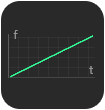|||--|**Sine**<br>正弦曲线||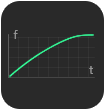|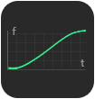|
|**Quad**<br>二次曲线|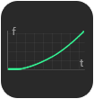||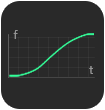|--|**Cubic**<br>三次曲线||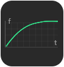|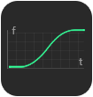|
|**Quart**<br>四次曲线|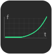|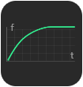|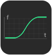|--|**Quint**<br>五次曲线|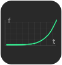|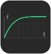|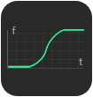|
|**Expo**<br>指数曲线|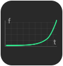|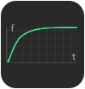|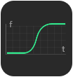|--|**Circ**<br>圆形曲线|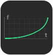|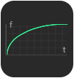|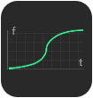|
|**Elastic**<br>弹性曲线|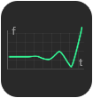|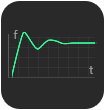|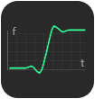|--|**Back**<br>回退曲线|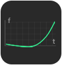|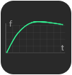|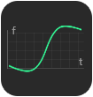|
|**Bounce**<br>弹跳曲线|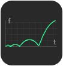|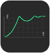|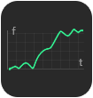|

### 📦 灵活的扩展类
------------
| 序号 | 类名称                     | 分类          |
|:------:|:----------------------------:|:---------------:|
| ✅    | `XTween.Alpha`             | **基础动画**       |
| ✅    | `XTween.AnchoredPosition`  | **UI动画**        |
| ✅    | `XTween.Color`             | **颜色动画**       |
| ✅    | `XTween.Fill`              | **填充动画**       |
| ✅    | `XTween.Path`              | **路径动画**       |
| ✅    | `XTween.Rotation`          | **旋转动画**       |
| ✅    | `XTween.Scale`             | **缩放动画**       |
| ✅    | `XTween.Shake`             | **抖动动画**       |
| ✅    | `XTween.Size`              | **尺寸动画**       |
| ✅   | `XTween.Text`              | **文本动画**       |
| ✅   | `XTween.Tiled`             | **平铺动画**       |
| ✅   | `XTween.TmpText`           | **临时文本动画**   |
| ✅   | `XTween.To.Color`          | **颜色过渡**       |
| ✅   | `XTween.To_Float`          | **浮点数过渡**     |
| ✅   | `XTween.To_Int`            | **整数过渡**       |
| ✅   | `XTween.To.String`         | **字符串过渡**     |
| ✅   | `XTween.To.Vector2`        | **二维向量过渡**   |
| ✅   | `XTween.To.Vector3`        | **三维向量过渡**   |
| ✅   | `XTween.To.Vector4`        | **四维向量过渡**  |


### 📦 可视化路径工具
------------
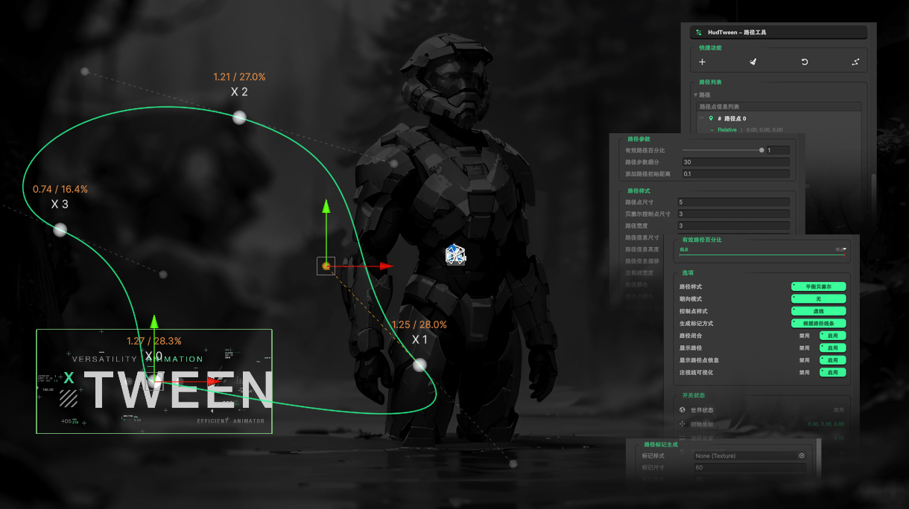

<br>

### 📦 可视化动画控制器
------------
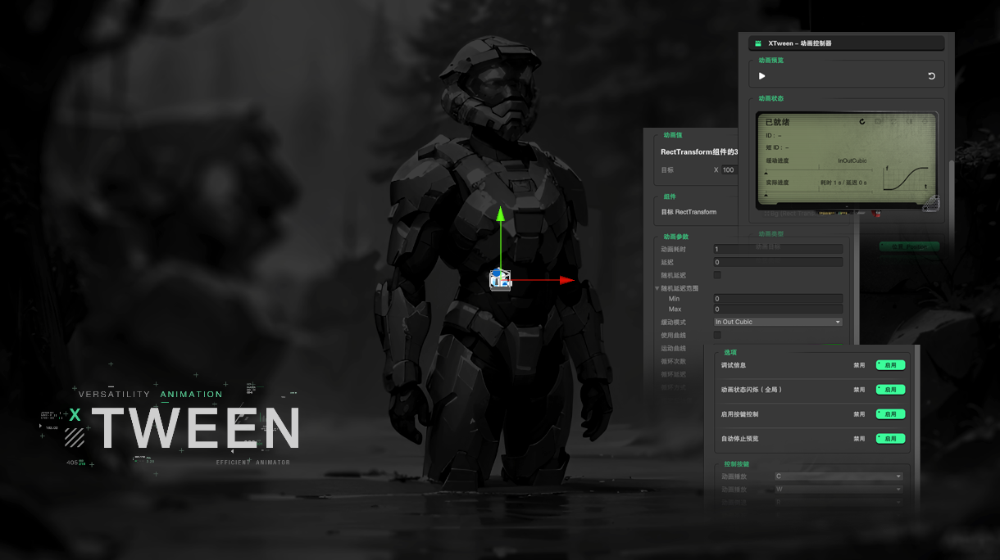

<br>

### 📦 可视化动画管理器
------------
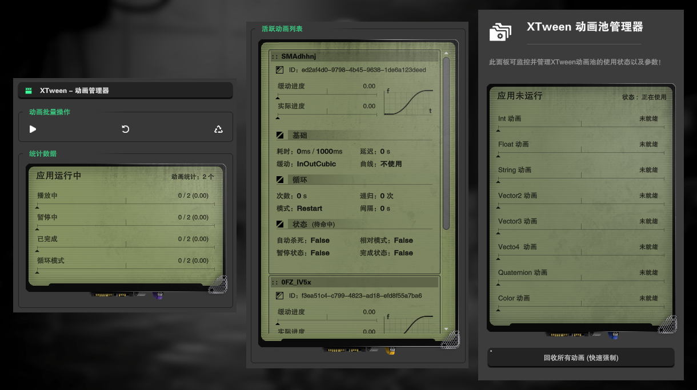

<br>

### 📦 生命周期
------------
#### - ▶️**Tween_Controller** 


#### - ▶️**XTween_Pool** 

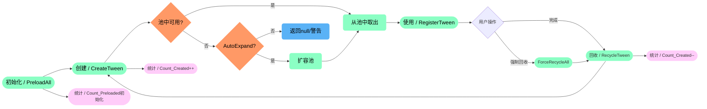

#### - ▶️**XTween_Manager** 

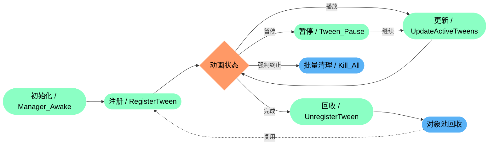

#### - ▶️**XTween_Previewer** 

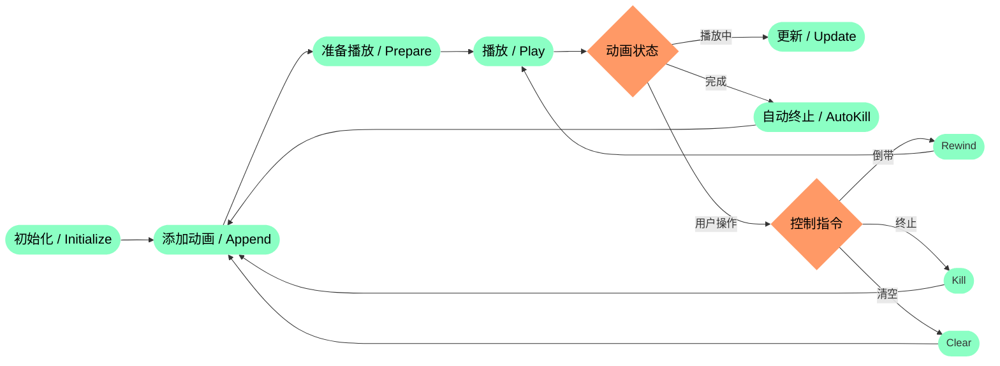

#### - ▶️**XTween_Base (With Specialized)** 

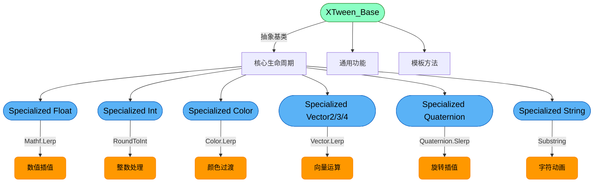
