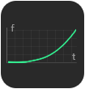

## XTween 动画插件
### 概述
XTween 是一个高性能的 Unity 动画系统，提供了丰富的动画类型、缓动效果和灵活的控制方式。它采用对象池技术优化性能，支持编辑器预览，适用于 UI 和游戏对象的动画处理。 并且该插件是一个功能全面、性能优化的 Unity 动画解决方案，适用于各种动画需求，从简单的 UI 动效到复杂的游戏对象动画

|开源不易，您的支持是持续更新的动力， 这个小工具倾注了我无数个深夜的调试与优化，它永远免费，但绝非无成本，如果您觉得这个工具 能为您节省时间、解决问题，甚至带来一丝愉悦，请考虑赞助一杯咖啡，让我知道：有人在乎这份付出，而这将成为我熬夜修复Bug〠添加新功能的最大动力。开æºä¸æ˜¯ç”¨çˆ±å‘电，您的认å¯ä¼šè®©å®ƒèµ°å¾—æ›´è¿œ| |
|:-|-:|
| **欢迎加入技术研讨群，在这里可以和我以及大家一起探讨插件的优化以及相关的技术实现思路，同时在做项目时遇到的众多问题以及瓶颈 阻碍都可以互相探讨学习**| |
 

### 📦 丰富的缓动库

|缓动类型|In|Out|InOut||缓动类型|In|Out|InOut|
|:-:|:-:|:-:|:-:|:-:|:-:|:-:|:-:|:-:|
|Linear 线性||||--|Sine 正弦曲线||||
|Quad 二次曲线||||--|Cubic 三次曲线||||
|Quart 四次曲线||||--|Quint 五次曲线||||
|Expo 指数曲线||||--|Circ 圆形曲线||||
|Elastic 弹性曲线||||--|Back 回退曲线||||
|Bounce 弹跳曲线||||

 

### 📦 生命周期
------------
#### - ▶️**Tween_Controller** 

```mermaid
flowchart LR
    %% ===== 核心流程 =====
    A([创建 / Tween_Create]) --> B([播放 / Tween_Play])
    B --> C{用户操作}
    C -->|暂停| D([暂停 / Tween_Pause])
    D -->|继续| B
    C -->|重播| E([重播 / Tween_Replay])
    E --> B
    C -->|停止| F([停止 / Tween_Stop])
    F --> G([销毁 / Tween_Kill])
    G --> H[对象池回收]

    %% ===== 循环路径 =====
    H -.->|复用| A

    %% ===== 样式定义 =====
    classDef process fill:#8bffc4,stroke:#ffffff00,stroke-width:2px,rx:8px,ry:8px
    classDef decision fill:#ff9966,stroke:#fbbc0400
    classDef endpoint fill:#5AB2F6,stroke:#4285f400,rx:8px,ry:8px
    class A,B,D,E,F,G process
    class C decision
    class H endpoint

    %% ===== 方法名样式 =====
    classDef method font-style:normal,font-size:20px,color:#000000
    class A,B,C,D,E,F,G,H method
```

#### - ▶️**XTween_Pool** 

#### - ▶️**XTween_Manager** 

```mermaid
flowchart LR
    %% ===== 核心流程 =====
    A([初始化 / Manager_Awake]) --> B([注册 / RegisterTween])
    B --> C{动画状态}
    C -->|播放| D([更新 / UpdateActiveTweens])
    C -->|暂停| E([暂停 / Tween_Pause])
    E -->|继续| D
    C -->|完成| F([回收 / UnregisterTween])
    F --> G([对象池回收])
    C -->|强制终止| H([批量清理 / Kill_All])

    %% ===== 管理循环 =====
    D --> C
    G -.->|复用| B

    %% ===== 样式定义 =====
    classDef process fill:#8bffc4,stroke:#ffffff00,stroke-width:2px,rx:8px,ry:8px
    classDef decision fill:#ff9966,stroke:#fbbc0400
    classDef endpoint fill:#5AB2F6,stroke:#4285f400,rx:8px,ry:8px
    class A,B,D,E,F process
    class C decision
    class G,H endpoint

    %% ===== 方法名样式 =====
    classDef method font-style:normal,font-size:20px,color:#000000
    class A,B,C,D,E,F,G,H method

    %% ===== 特殊说明 =====
    click A "javascript:alert('单例初始化+预加载池')"
    click D "javascript:alert('每帧更新+迭代器缓存优化')"
    click F "javascript:alert('清理索引+移入待处理队列')"
```

#### - ▶️**XTween_Previewer** 

```mermaid
flowchart LR
    %% ===== 核心流程 =====
    A([初始化 / Initialize]) --> B([添加动画 / Append])
    B --> C([准备播放 / Prepare])
    C --> D([播放 / Play])
    D --> E{动画状态}
    E -->|播放中| F([更新 / Update])
    E -->|完成| G([自动终止 / AutoKill])
    E -->|用户操作| H{控制指令}
    
    %% ===== 控制分支 =====
    H -->|倒带| I([Rewind])
    H -->|终止| J([Kill])
    H -->|清空| K([Clear])
    
    %% ===== 循环路径 =====
    I --> D
    J --> B
    K --> B
    G --> B

    %% ===== 样式定义 =====
    classDef process fill:#8bffc4,stroke:#ffffff00,stroke-width:2px,rx:8px,ry:8px
    classDef decision fill:#ff9966,stroke:#fbbc0400
    classDef endpoint fill:#5AB2F6,stroke:#4285f400,rx:8px,ry:8px
    class A,B,C,D,F,G,I,J,K process
    class E,H decision

    %% ===== 方法名样式 =====
    classDef method font-style:normal,font-size:20px,color:#000000
    class A,B,C,D,E,F,G,H method

    %% ===== 特殊说明 =====
    click A "javascript:alert('静态初始化+注册编辑器更新事件')"
    click F "javascript:alert('每帧检测：\\n1. 自动停止条件\\n2. 动画状态更新\\n3. 场景重绘')"
    click G "javascript:alert('触发条件：\\n1. 达到MaxTotalDuration\\n2. 所有动画完成')"
```

#### - ▶️**XTween_Base (With Specialized)** 

### 📦 核心组件
------------
#### - ▶️**Tween_Controller 动画控制器** 
- ##### 支持多种动画类型（位置、旋转、缩放、颜色等）
- ##### 可配置动画参数（持续时间、延迟、缓动模式等）
- ##### 提供按键控制（播放、倒带、终止等）

#### - ▶️**XTween_Interface 动画接口**
- ##### 支持多种动画类型（位置、旋转、缩放、颜色等）
- ##### 可配置动画参数（持续时间、延迟、缓动模式等）
- ##### 提供按键控制（播放、倒带、终止等）

#### - ▶️**XTween_Pool 动画对象池** 
- ##### 支持多种动画类型（位置、旋转、缩放、颜色等）
- ##### 可配置动画参数（持续时间、延迟、缓动模式等）
- ##### 提供按键控制（播放、倒带、终止等）

#### - ▶️**XTween_Manager 动画管理器** 
- ##### 动画注册/注销
- ##### 每帧更新动画状态
- ##### 提供动画查找功能

#### - ▶️**XTween_EaseLibrary 缓动函数库** 
- ##### Linear（线性）
- ##### Sine（正弦）
- ##### Quad（二次）
- ##### Cubic（三次）
- ##### Elastic（弹性）
- ##### Bounce（弹跳）等

#### - ▶️**XTween_Previewer 编辑器预览系统** 
- ##### 支持多种动画类型（位置、旋转、缩放、颜色等）
- ##### 可配置动画参数（持续时间、延迟、缓动模式等）
- ##### 提供按键控制（播放、倒带、终止等）
